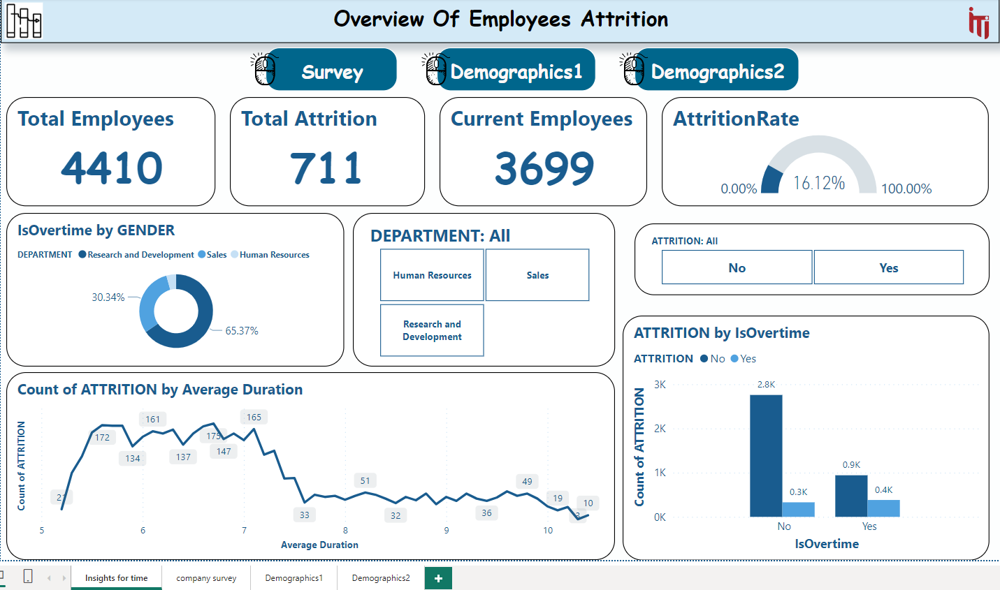
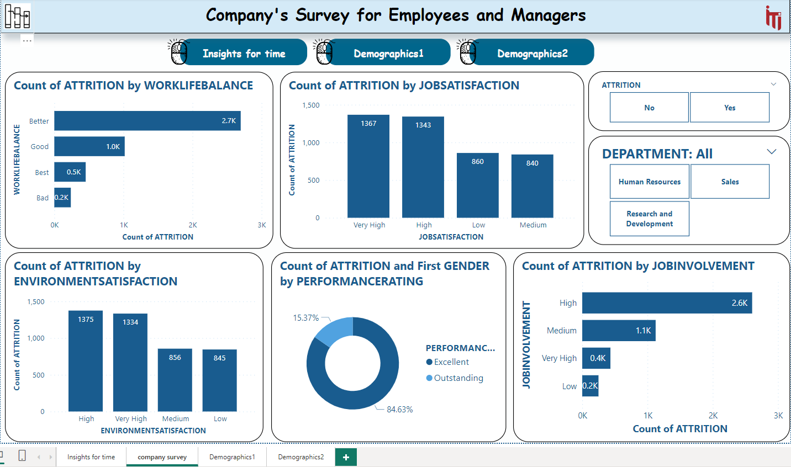
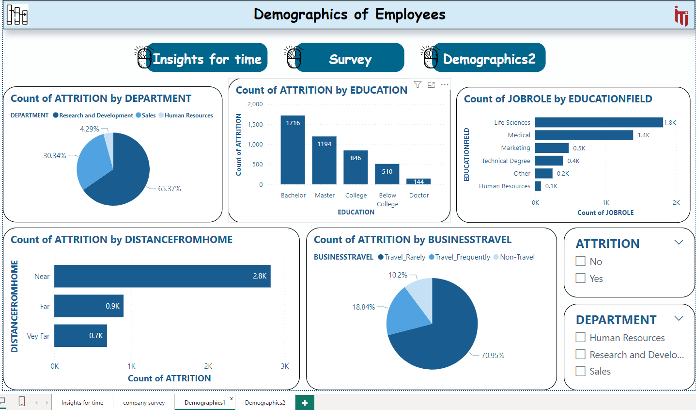
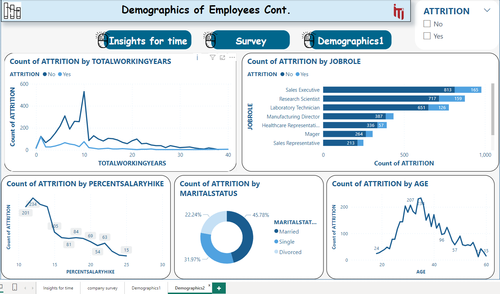

# Analysing-Employee-Attrition-using-Power-BI

## Introduction
This project aims to analyze employee attrition within ABC Corporation using Power BI. By leveraging data from employee surveys, manager assessments, demographic information, and clock-in data, the project seeks to identify key drivers of attrition, conduct segmentation analysis, and develop actionable insights and recommendations.

## Objectives
1. **Identify Key Drivers of Attrition:** Determine primary factors influencing employee attrition.
2. **Segmentation Analysis:** Analyze attrition rates across different segments (departments, job roles, genders, education levels, etc.) to identify high-risk groups.
3. **Dashboard and Reporting:** Design an interactive dashboard to present insights and recommendations effectively.

## Data Sources
- **Database:** Includes employee survey responses, manager assessments, and demographic information.
- **IN/OUT Times:** Contains clock-in data for all employees for the year 2015.

## Methodology
1. **Data Collection:** Import data from various sources including databases and CSV files.
2. **Data Preparation:** Clean and preprocess data for analysis.
3. **Data Modeling:** Build a dimensional model integrating all data sources.
4. **Analysis:** Identify key drivers of attrition and conduct segmentation analysis.
5. **Visualization and Dashboarding:** Design visually appealing and interactive dashboards.

## SnapShots
# 
# 
# 
# 
